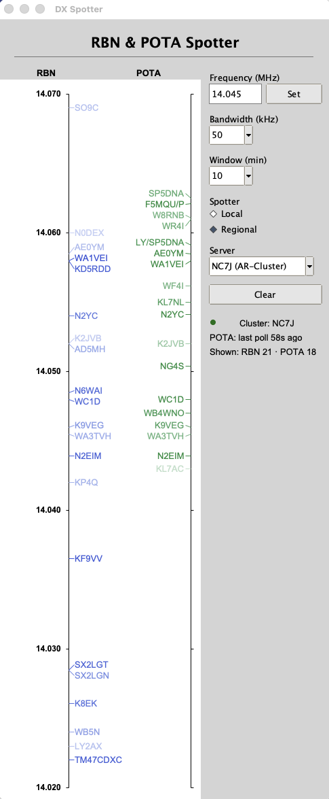

# DX Spotter: a Bandscope-style bandmap for CW, RBN and POTA



*The finished app on macOS (live data, Regional spotters, 14.045 MHz, 50 kHz span).*

## What it is

A macOS bandmap for a CW/DX operator, modelled on the N1MM bandmap and used here as a stand-in for a Bandscope.

- **Left scale (RBN):** CW spots from the NC7J AR-Cluster, limited to the Local or Regional skimmers. Each call sign sits on a leader line to its frequency on a vertical linear scale.
- **Right scale (POTA):** CW spots from the POTA.app API, polled every minute.
- **Spots fade** over 5, 10 or 15 minutes. Clicking a call sign copies it to the clipboard.
- **Side panel:** frequency, bandwidth, fade time, Local/Regional, Clear, and connection status. The window is resizable.

The app is Python 3.13 with Tkinter. Run it with `python -m spotter` (see [docs/setup.md](docs/setup.md)).

## What this repo is really for

This repo is a **pressure test of [`masterplan-generator.md`](masterplan-generator.md)**, a set of 20 prompts that helps a new Claude Code user go from an idea to a working app without writing the spec by hand.

The test: start with only an idea and a screenshot, let the generator produce a masterplan, then have Claude Code build the whole app from that masterplan. The DX Spotter is the test subject. It is a good one because it has two live data sources, a pixel-checkable screen, and real-time behaviour.

## The method, in four files

| File | Role |
|---|---|
| [`idea.md`](idea.md) | The app brief, written in an interview with Claude Code: purpose, platform, features, inputs, data sources. |
| [`screenshot.png`](screenshot.png) | The look to match (an existing Linux app of the same kind). The build measures it with a script and checks the result against those numbers. |
| [`masterplan-generator.md`](masterplan-generator.md) | The 20 prompts. The user pastes them into Claude Code to build the masterplan. |
| [`masterplan.md`](masterplan.md) | The result, and the source of truth for the build. Four parts: **Constitution** (rules for how the agent works), **Spec** (features, screen list, data sources and how each is checked), **Tech** (language, modules, tables, open items), **Tasks** (five stages, each with a "done when" line). |

The flow: `idea.md` + `screenshot.png` → generator prompts → `masterplan.md` → "Build from masterplan.md, starting with Task 1."

## What the build produced

- **Stage 1, environment:** checks, venv, and measurements of the screenshot (`measurements.json`, 19 screen elements).
- **Stage 2, data connections:** tested against the live NC7J cluster and the live POTA API; raw captures saved in `tests/captures/`.
- **Stage 3, core logic:** parsers, filter, store with fade, settings, label layout, all offline and testable.
- **Stage 4, features and guards:** controls, live spots, fading, click-to-copy, plus guards for responsiveness, threads and the clipboard.
- **Stage 5, UI:** layout compared with the screenshot measurements (147 numbers, ±4 px), resizing, failure tests, and a fresh-clone run from `docs/setup.md`.

Results: 93 tests pass, live checks of both data sources and the running app pass, and the layout check passes 26 of 26 screen elements.

## What the test showed

Short lessons for the generator, from the build review (the full list is in the masterplan's known limitations and decisions):

- **Real data beats the spec.** The live cluster has spot lines the brief did not describe (human spots with no mode, skimmer names like `W6YX-2-#`), found only by saving a real capture first.
- **Measure, don't eyeball.** A pixel checker caught layout errors that looked fine, and also needed fixing itself (colour-managed screenshots, 1 px gaps).
- **The sandbox blocks some ports.** Live network checks need the user to allow them; the generator now says to ask at the start.
- **Decisions need numbers.** Ambiguities (fade curve, store rules, what Clear does) were settled by a pressure-test pass before the build.

## Repo layout

```
idea.md  screenshot.png  masterplan-generator.md  masterplan.md   the method
spotter/        the app (models, parsers, filter, store, settings, layout, clients, app logic, ui)
tests/          pytest suite and saved live captures (tests/captures/)
tools/          screenshot measuring, window capture, layout checker, live checks
docs/setup.md   environment and run steps
measurements.json   measured positions from screenshot.png
```

## Try it

```sh
git clone git@github.com:jcarter-labs/RSGB-3.git && cd RSGB-3
/opt/homebrew/bin/python3.13 -m venv .venv && source .venv/bin/activate
pip install -r requirements.txt
python -m spotter
```

To try the method on your own app, follow [`masterplan-generator.md`](masterplan-generator.md) with your own idea and screenshot.

## Rights

© 2026 John Carter (N6YU). No license is granted for reuse beyond viewing and forking on GitHub. Prepared for RSGB Convention 2026; contact john@n6yu.com for permissions.
